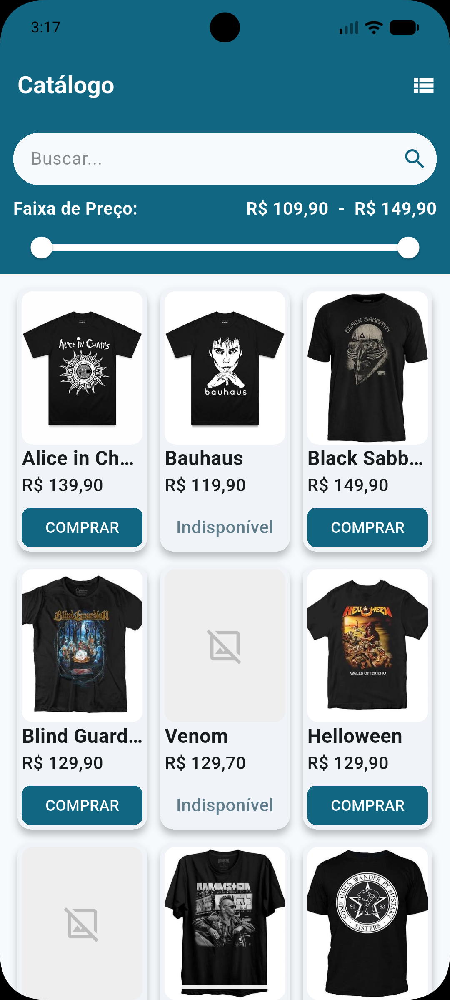
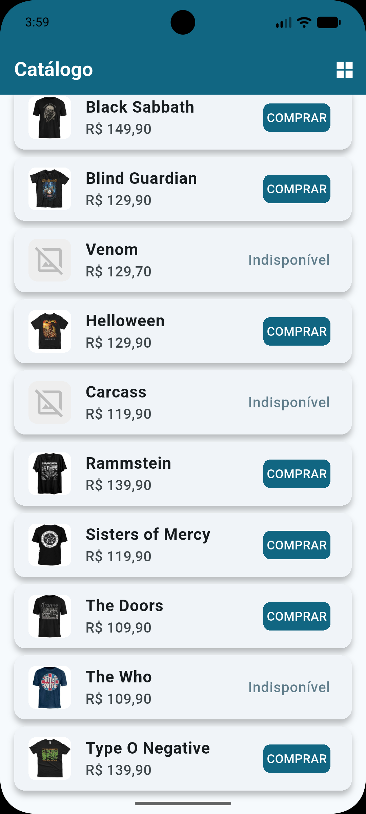
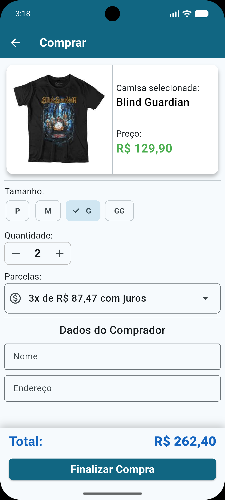

# App de Catálogo de Camisetas

Um aplicativo desenvolvido em Flutter para listagem, filtragem e simulação de compra de camisetas. Este projeto foi construído seguindo uma arquitetura **MVVM** simplificada, usando `setState()` e navegação com rotas nomeadas.

---
## 📸 Demonstração

Vídeo: https://drive.google.com/file/d/1AIkylSLB00HT9BOWGEgUfuXZyVUPAkGx/view?usp=drive_link

| Tela 1: Catálogo (Grade) | Tela 1: Catálogo (Lista) |
| :---: | :---: |
|  |  |

| Tela 2: Formulário de Compra |
| :---: |
|  |

---
## 📱 Funcionalidades e Requisitos Implementados

### Camada de Dados e Entidades
*   **Mapeamento JSON:** Transformação completa de payloads JSON em objetos fortemente tipados através de entidades dedicadas.
*   **Entidade de Compra:** Objeto de modelo estruturado contendo todas as propriedades do pedido (tamanho, quantidade, valor total, parcelas, responsável e endereço).

### Tela 1: Catálogo de Camisetas
*   **Lazy Loading:** Exibição otimizada da listagem de produtos com carregamento sob demanda.
*   **Visualização Dinâmica:** Alternância em tempo real entre os modos de exibição em **Lista** ou **Grade**.
*   **Filtros Avançados:**
    *   Barra de pesquisa reativa que filtra as camisetas por texto.
    *   Filtro dinâmico por faixa de **Valor Mínimo e Máximo** (utilizando `RangeSlider`).
*   **Card de Produto Resiliente:**
    *   Tratamento de erro nativo para links de imagens quebrados ou indisponíveis (`errorBuilder`).
    *   Formatação monetária padrão em Real (**R$ xx,xx**).
*   **Navegação Segura:** Transição para a tela de finalização de compra através de rotas nomeadas passando o produto como argumento.

### Tela 2: Detalhes e Fluxo de Compra
*   **Interface Detalhada:** Exibição da imagem do produto selecionado e preço unitário.
*   **Formulário de Pedido Completo:**
    *   Seleção de tamanho.
    *   Ajuste de quantidade com limite definido (Mínimo de **1** e Máximo de **5** unidades).
    *   Opção de parcelamento em até **6x**.
    *   Campos de texto para Nome do Comprador e Endereço de Entrega.
*   **Cálculo em Tempo Real:**
    *   Atualização instantânea do valor total no card conforme a alteração da quantidade e parcelamento.
    *   **Regra de Juros:** Aplicação automática de **0,5% de juros por parcela adicional** a partir da segunda parcela (ex: 1x = sem juros, 2x = +0.5%, 3x = +1.0%...).
*   **Validação Estrita de Formulário:**
    *   Exibição visual de erros através de `Validator` nos campos de texto e disparo de `SnackBar` de erro caso haja tentativa de submissão com dados inválidos ou campos vazios.
*   **Sucesso e Ciclo de Dados:**
    *   Ao validar com sucesso, exibe uma `SnackBar` de confirmação ("*Compra realizada com sucesso*").
    *   A entidade de compra é alimentada e enviada via caminho reverso até a camada de serviços.
    *   O payload final do pedido é impresso no console como **JSON estruturado** pela camada de serviço.
    *   Após o término da animação do sucesso, o app realiza o *pop* automático retornando à tela de catálogo.

---

## 🚀 Como executar

### Pré-requisitos

- [Flutter SDK](https://docs.flutter.dev/get-started/install) instalado (versão 3.44.4 ou superior)
- Um emulador Android/iOS configurado, ou dispositivo físico conectado

### Passos

```bash
# Clone o repositório
git clone https://github.com/cicerobas/projeto_avaliativo_camisetas_de_banda.git

# Entre na pasta do projeto
cd projeto_avaliativo_camisetas_de_banda/

# Instale as dependências
flutter pub get

# Rode o projeto
flutter run
```
